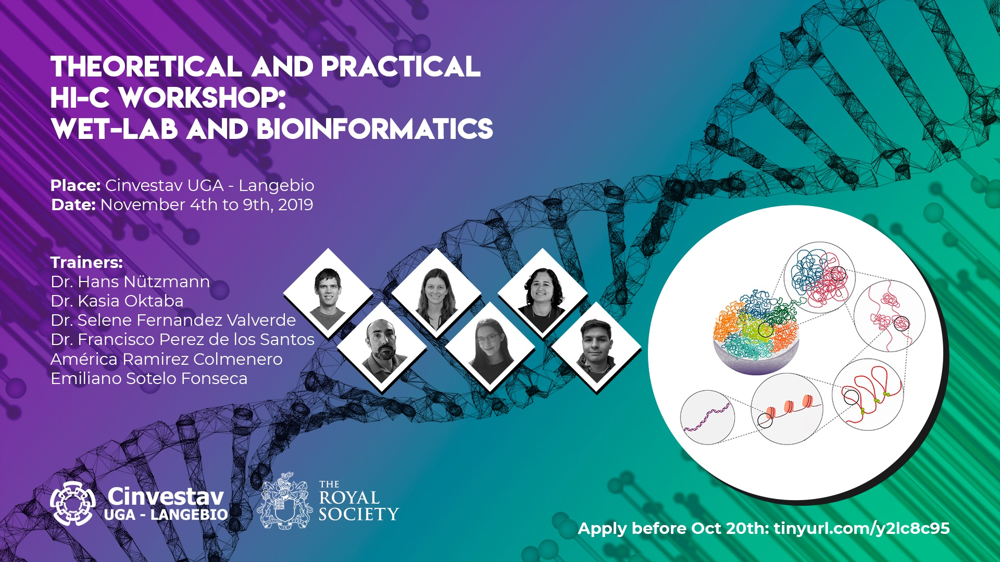

### Team:

* Kasia Oktaba - Instructor
* Hans Nuetzmann - Instructor
* Selene L. Fernandez-Valverde - Instructor
* Francisco Javier Pérez de los Santos - Instructor
* Jesús Emiliano Sotelo Fonseca - Instructor
* América Ramírez Colmenero - Instructor
* José Antonio Corona Gómez - Helper
* Evelia Lorena Coss Navarrete - Helper
* Mariana Tiscareno Andrade - Helper
* Mayra Flores Barraza - Assistant

### Schedule

You can consult the schedule here: 

[Schedule](https://docs.google.com/document/d/1ToIqbE2ANcaL2NIeprm4A3_wXU54vLlRay7s1IzhuKo/edit?usp=sharing).

### Experimental protocol

Link to exp protocol PDF
[Protocol](SLIDES/Hi_C_workshop_protocol_Final.pdf).

### Bioinformatics Syllabus

1. Introduction to next generation sequencing techniques and HiC data. 
	* [Lecture](SLIDES/01_HiCWorkshop_Intro_to_NGS.pdf)
	* [Prerequisites](00-prereq.html)
2. Quality control of HiC data.
	* [Lecture](SLIDES/1_mapping_filtering.pdf)
	* [Practical](01-quality.html)
3. HiC read alignment
	* [Practical](03-hicup.html)
4. HiC Matrix construction and correction
	* [Lecture](SLIDES/02_lecture_matrix_binning_correction.pdf)
	* [Practical](04-matrix.html)
5. HiC Data formats and visualization
	* [Lecture](SLIDES/3_matrix_visualization.pdf)
	* [Practical](05-visualization.html)
6. Compartment Analysis
	* [Lecture](SLIDES/4_feature_annotation_compartments_tads.pdf)
	* [Practical](06-feature_calling.html)
7. Differential interactions
	* [Lecture](SLIDES/5_differential_interactions.pdf)
	* [Practical](07_diffhic.html)
	

